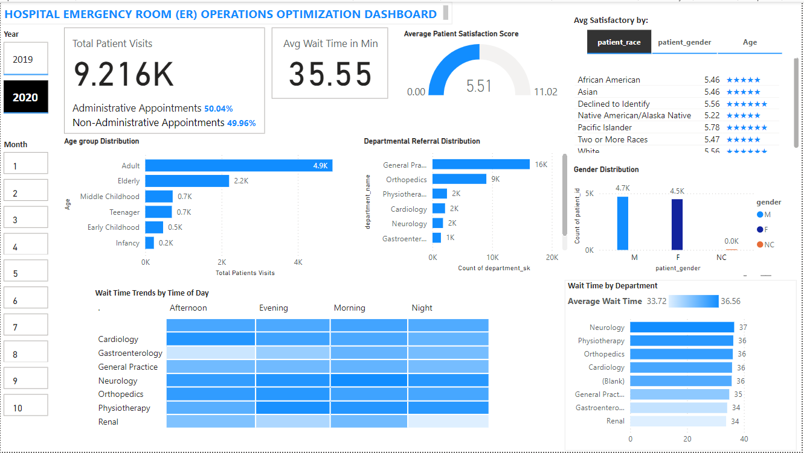

# Hospital Emergency Visits Business Intelligence Project

## Project Background

The Hospital Emergency Visits Business Intelligence Project aims to provide actionable insights into hospital emergency room operations by analyzing patient visit data. Using an end-to-end approach, this project leverages Python, SQL Server, and Power BI to transform raw data into meaningful visualizations that highlight key performance indicators (KPIs) such as patient wait times, satisfaction levels, admission rates, and department trends. This analysis not only enhances operational efficiency but also informs decision-making, ultimately improving patient care and resource allocation.

### Business Case Definition

The business case centers on addressing critical challenges within hospital emergency room operations, specifically targeting inefficiencies in patient flow, satisfaction tracking, and resource allocation. By implementing a sophisticated BI solution, the project seeks to convert raw operational data into strategic intelligence that can drive meaningful improvements in healthcare service delivery. The solution will focus on analyzing patient demographics, wait times, satisfaction scores, and departmental referral patterns to identify opportunities for optimization and enhance overall patient care.

### Scope and Limitations

The scope of this project involves analyzing emergency room visit data to gain insights into key performance metrics such as patient wait times and satisfaction scores. Leveraging tools like Python, SQL Server, and Power BI, the analysis focuses on a specific time period to ensure targeted and relevant findings. However, the project is subject to several limitations. The dataset used represents a small sample size, which may impact the generalizability of the results. Additionally, there is potential for demographic representation bias, as the sample may not fully capture the diversity of the population served by the emergency room. The analysis is also constrained by limited historical data, which can restrict the ability to identify long-term trends. Furthermore, inconsistencies in data collection practices may affect the accuracy and completeness of the dataset, posing challenges to drawing comprehensive conclusions.

### Data Source

The source system for this project was a dataset hosted on Data.World, a collaborative data platform that provides easy access to structured and curated datasets. The specific dataset, titled "Hospital ER," served as the foundation for analyzing emergency room visits. This system was chosen due to its open accessibility, well-organized data, and compatibility with Python's datadotworld library, which enabled seamless extraction of data through API integration.

## Findings

#### 1. Average Wait Time findings:

a) An increase in average wait times from 35.03 minutes in 2019 to 35.55 in 2020 indicating a slight decline in operational efficiency, potentially due to higher patient volumes, resource constraints, or workflow bottlenecks. This trend highlights the need for targeted strategies to optimize patient flow, improve staff allocation, and address factors contributing to delays in the emergency room.
b) The average wait time by department decreased from 33.81 minutes in 2019 to 33.72 minutes in 2020. The Gastroenterology department, which recorded the highest average wait time of 37 minutes in 2019, showed notable improvement, reducing its wait time to 34 minutes in 2020. Conversely, the Neurology department experienced an increase in average wait time, rising from 36 minutes in 2019 to 37 minutes in 2020, highlighting the need for an operational review and resource optimization to address inefficiencies.

#### 2. Patient Satisfaction Scores findings

The Patient Satisfaction Score increased from 5.42 in 2019 to 5.51 in 2020, indicating a slight improvement in overall patient satisfaction. However, this positive trend is accompanied by a significant data gap: 6,699 out of 9,216 visits (approximately 73%) had no recorded satisfaction ratings. The lack of feedback from such a large percentage of visits presents a challenge in accurately assessing the true patient experience and identifying areas for improvement.

#### 3. Departmental Referral Distribution findings

The General Practice department saw a 14% increase in referrals, rising from 14K in 2019 to 16K in 2020, while the Orthopedics department experienced a 12.5% increase, growing from 8K in 2019 to 9K in 2020. Cardiology, Physiotherapy, and Neurology departments remained stable at 2K referrals each for both years, showing no significant change in demand.

#### 4. Patient Demographics Analysis

The Age Group Distribution graph reveals that the majority of patients fall into the Adult age group, accounting for 4.8% of the total. The Elderly and Middle Childhood age groups make up the next largest proportions, with 2.2% and 0.7% respectively. The Teenager, Early Childhood, and Infancy age groups have the smallest percentages, all below 0.2%. Turning to the Gender Distribution, the data shows that the patient population is predominantly Male, making up 5.0% of the total. Females account for 4.7% of the patients. There is a very small percentage (0.0%) of patients with an unspecified or non-conforming gender.

#### 5. Administrative vs. Non-Administrative Appointments

The findings indicate a near-equal distribution between Administrative and Non-Administrative Appointments, with 50.04% of appointments categorized as Administrative and 49.96% as Non-Administrative. This balanced split suggests that both types of appointments are nearly equally represented, highlighting the importance of both operational functions in the organization.

## Insights Deep-Dive

1. The gap in the Patient Satisfaction Score data collection highlights the need for improvements in the feedback collection process. Strategies such as simplifying the feedback process, increasing patient awareness, or implementing automated systems to prompt feedback could help capture a more representative sample of patient experiences. By addressing the missing data issue, the hospital could gain more accurate and actionable insights into patient satisfaction, enabling targeted improvements in service quality and patient care.

2. The notable increases in General Practice and Orthopedics reflect growing workloads in these departments, which may necessitate additional resources, staff, or process optimizations to effectively manage rising patient volumes. In contrast, the lack of significant change in smaller departments such as Cardiology, Gastroenterology, and Renal suggests consistent but lower patient demand, presenting opportunities for resource reallocation or targeted awareness programs to improve utilization and balance workloads across departments.
   
3. While the balance of administrative and non-administrative appointments may seem minor, its impact on hospital efficiency is substantial. Optimizing administrative processes not only shortens patient wait times but also contributes to better resource management, improved staff productivity, and enhanced patient satisfaction. Identifying and addressing inefficiencies in administrative tasks will have a ripple effect, enhancing the overall performance and quality of care within the hospital.
